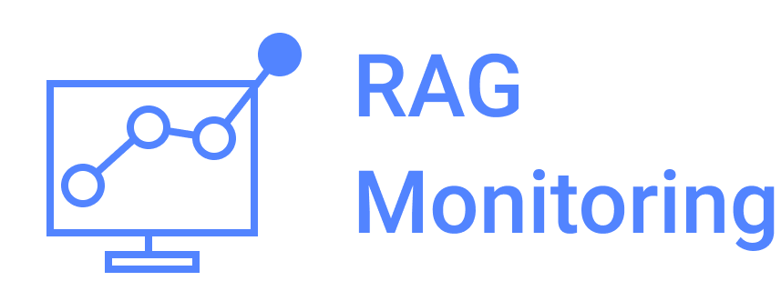
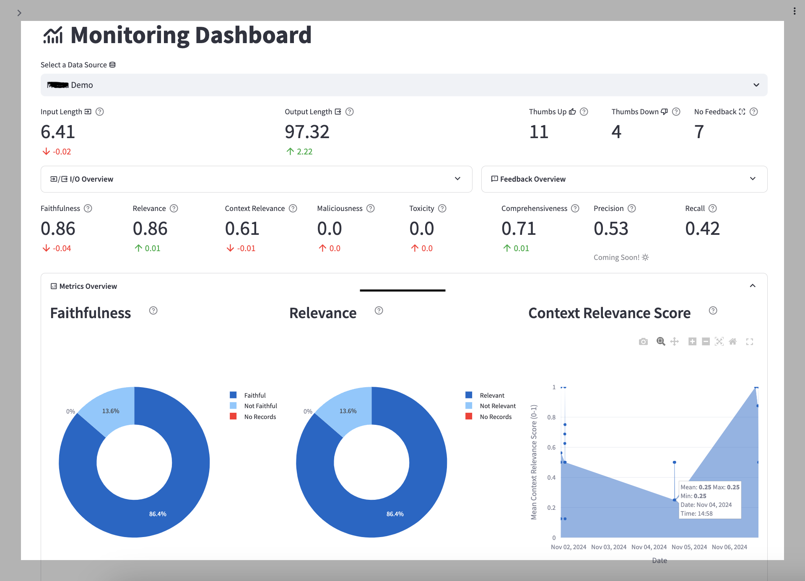

# RAG Monitoring

  

### What is RAG Monitoring?

AMP for collecting and visualizing monitoring data (in this case RAG)

### Overview of the AMP

The RAG Monitoring feature helps track the quality and health of Retrieval-Augmented Generation (RAG) applications using a curated set of pre-built metrics and evaluators. It leverages Large Language Models (LLMs) as judge to compute various quality scores, which are then aggregated and visualized over time in a dashboard. The dashboard provides both summary metrics and trends over time.

Our list of pre-built metrics is regularly updated. Currently, the following metrics are available:

- **Input/Output Word Count Statistics**
- **User Feedback**
- **Context and Final Response Quality**
- **Auto-Evaluation Metrics** (e.g., relevance, comprehensiveness, toxicity, faithfulness, Maliciousness)
- **Raw Input, Output, and Context Data**

  

### Pre-requisites

The AMP requires access to LLM and embedding models hosted either on AWS or Cloudera AI Inferencing. These options are mutually exclusive. Complete the setup for one of the following options before proceeding:

**For AWS:**

- The following models need to be configured and accessible via AWS Bedrock.
  - Llama3 70b Instruct V1 (`meta.llama3-70b-instruct-v1:0`)
- For Embedding, you will need to enable the following model in AWS Bedrock:
  - Cohere English Embedding v3 (`meta.cohere-english-embedding-v3:0`)

**For Cloudera AI Inferencing provide:**

- Inference model endpoint
- Embedding model endpoint

### Common Issues

- Both the Llama and Cohere models must be enabled in AWS Bedrock for the AMP to function properly. If the models are not enabled, the AMP will not function as expected.

## Installation

Follow the [standard instructions](https://docs.cloudera.com/machine-learning/cloud/applied-ml-prototypes/topics/ml-amp-add-catalog.html) for installing this AMP into your CML workspace. The "File Name" to use is `catalog-entry.yaml`.

- Find the catalog entry in the AMP catalog.
- Start the AMP by `Configure & Deploy`

For configuring the project, you will need to provide some environment variables.

**For AWS:**

- `AWS_DEFAULT_REGION` - defaults to `us-west-2`
- `AWS_ACCESS_KEY_ID`
- `AWS_SECRET_ACCESS_KEY`

OR

**For Cloudera AI Inferencing:**

- CAII_DOMAIN
- CAII_INFERENCE_ENDPOINT_NAME
- CAII_EMBEDDING_ENDPOINT_NAME

## Getting Started with the RAG Monitoring Application

1. Set Up Your Data Source

- Create a collection and upload your knowledge base documents. Documents will be vectorized and stored as embeddings. You can set up multiple collections, each with its own chat interface and monitoring dashboard.

2. Start Chatting

- Use the Chat Application to interact with your documents.

3. Provide Feedback

- Rate responses instantly using thumbs-up/down feedback. Text feedback will be available soon.

4. Track Metrics

- Visit the monitoring dashboard to view real-time quality metrics for your RAG application. Metrics are summarized and tracked over time.

5. Dive Deeper

- Access raw input, output, and context data for detailed analysis.

## The Fine Print

IMPORTANT: Please read the following before proceeding. This AMP includes or otherwise depends on certain third party software packages. Information about such third party software packages are made available in the notice file associated with this AMP. By configuring and launching this AMP, you will cause such third party software packages to be downloaded and installed into your environment, in some instances, from third parties' websites. For each third party software package, please see the notice file and the applicable websites for more information, including the applicable license terms.

If you do not wish to download and install the third party software packages, do not configure, launch or otherwise use this AMP. By configuring, launching or otherwise using the AMP, you acknowledge the foregoing statement and agree that Cloudera is not responsible or liable in any way for the third party software packages.

Copyright (c) 2024 - Cloudera, Inc. All rights reserved.
